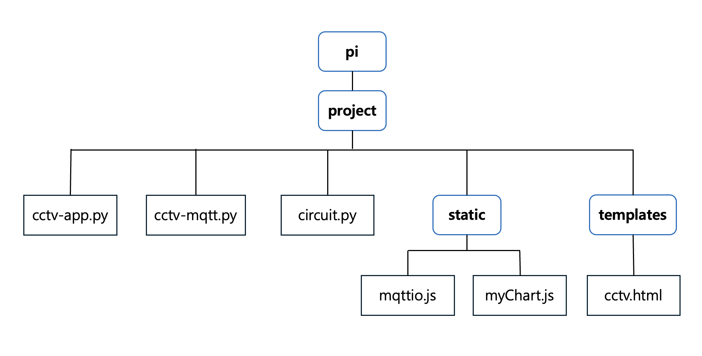

# 라즈베리를 이용한 CCTV시스템

## 1. 개요
   라즈베리파이에 카메라, 초음파 센서, LED를 연결하고 웹 브라우저를 통해
   - 실시간 CCTV 영상 스트리밍
   - 거리 측정 데이터를 실시간으로 시각화

   할 수 있는 시스템

   
   
## 2. 주요 기능

   - 실시간 CCTV 영상 스트리밍 (Flask)
   - LED 원격 제어 (MQTT)
   - 초음파 센서를 통한 실시간 거리 측정
   - 거리 데이터 차트 시각화 (myChart.js)

## 3. 구현 방법
   - **하드웨어**: 라즈베리파이, 카메라, 초음파 센서, LED

   
   
   - **소프트웨어 구성**   
     - cctv-app.py: Flask 웹 서버
     - cctv-mqtt.py: 브로커에 연결해 거리 데이터 전송
     - circuit.py: GPIO 제어
     - mqttio.js: 브로커 관련 함수
     - myChart.js: 거리 데이터 시각화
     - cctv.html: 웹 UI
       
   
     
## 4. 실행 및 결과

   - 웹 브라우저에서 라즈베리파이 IP로 접속

   
   
   - 발표 자료 (시연 영상): [youtube 링크](https://youtu.be/27KshG3Z6lI)

    

## 5. 아쉬운 점

   - 초기 시도: 거리 조건을 만족할 경우 화면을 캡처하는 기능을 추가하고 싶었으나 에러 발생
   - 문제: openCV는 카메라 하나당 하나의 접근만 허용
   - 해결 시도: '카메라 스트리밍 함수'와 '화면 캡처 함수'에서 같은 카메라 객체를 공유하기 위해
               전역 변수로 선언
   - 결과: 추가 캡처 시도 시 충돌이 발생하여 문제 해결 실패
   - 개선점: 비동기 처리 및 프레임 버퍼 분리 시도
